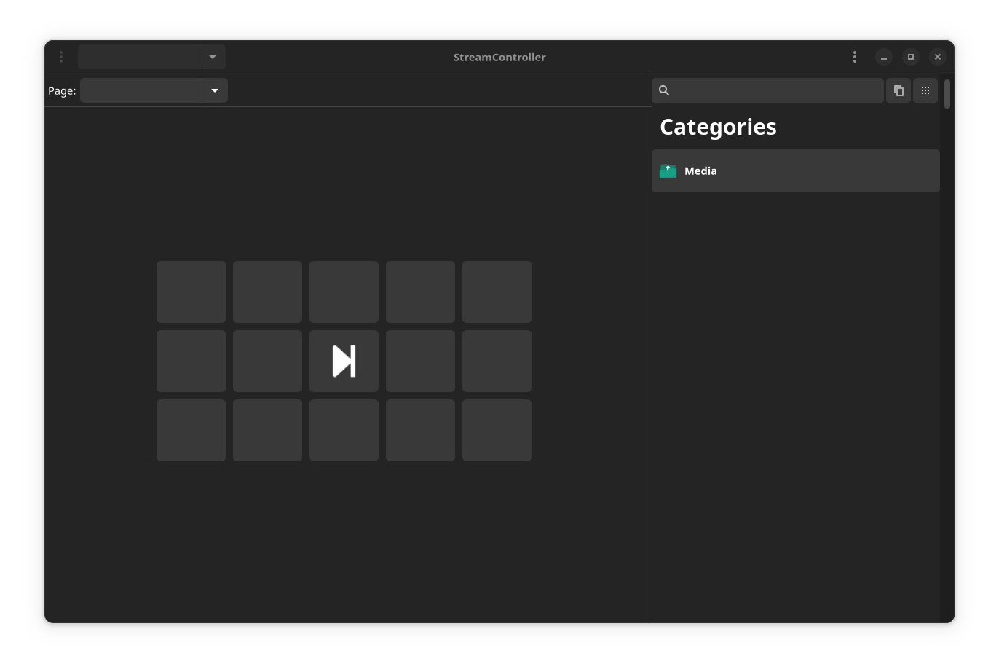

# StreamController

:warning: **Discontinued** :warning:
Please have a look at the [new version](https://github.com/Core447/StreamController).

This application can control Elgato StreamDecks on Linux.
It has plugin support and a nice GTK GUI.

This project uses [this](https://github.com/abcminiuser/python-elgato-streamdeck) Python library to control the StreamDeck.

## Planned features
- [x] GTK4 UI
- [x] Plugin support
- [x] In-App store for plugins
- [ ] Support for multiple StreamDecks at the same time
- [ ] Discord Server
- [ ] Official plugins for OBS etc.
- [ ] Website

## GUI
Currently the UI looks like this:

