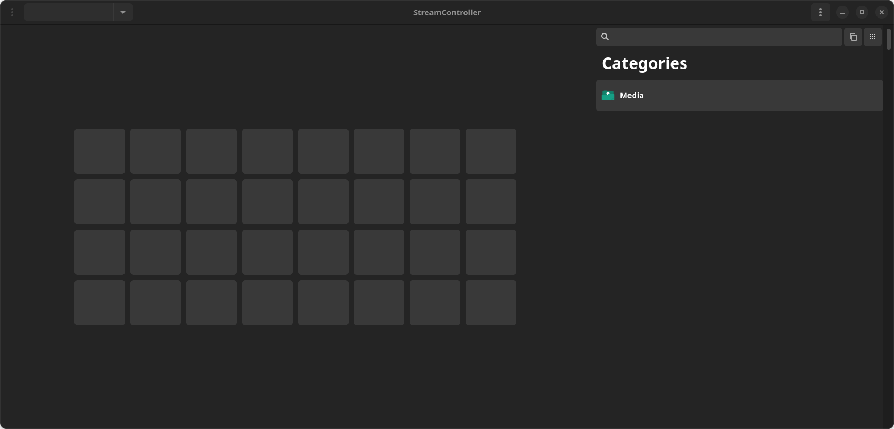

# StreamController

:warning: **WORK IN PROGRESS** :warning:

This application can control Elgato StreamDecks on Linux.
It has plugin support and a nice GTK GUI.

This project uses [this](https://github.com/abcminiuser/python-elgato-streamdeck) Python library to control the StreamDeck.

## Planned features
- Plugin support (in Python)
- Support for multiple StreamDecks at the same time
- GTK4 UI

## GUI
Currently the UI looks like this:

